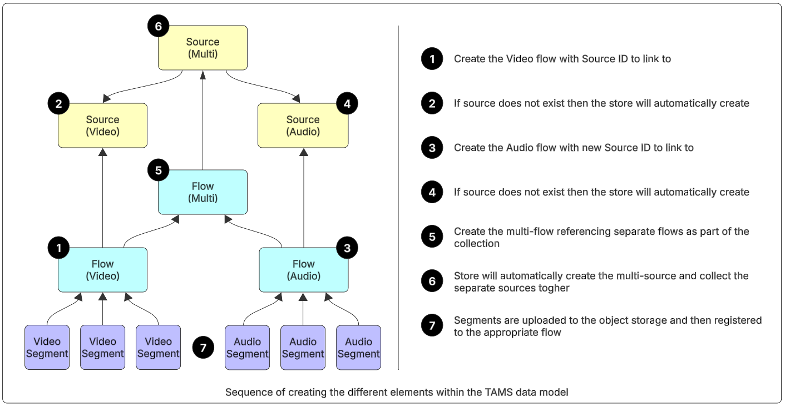

# Guidance for Cloud Native Fast Turnaround Workflows

## Table of Contents

1. [Overview](#overview)
2. [Prerequisites](#prerequisites)
3. [Usage](#usage)
4. [Next Steps](#next-steps)
5. [License](#license)

## Overview

A Time Addressable Media Store (TAMS) is a method of storing small chunks of media in object storage and tracking via an API using the [TAMS specification](https://github.com/bbc/tams) published by BBC R&D.  This allows live video and audio feeds to be ingested using S3 storage and made available to other systems for media processing while the ingest is still underway. 

This guidance provides a set of sample scripts to help people who are new to TAMS to learn the API.  This includes exploring key API call and uploading an initial set of content into the store.

This guidance can be used in combination with the following other AWS code repositories:
- [Open Source Implementation of the TAMS Specification](https://github.com/awslabs/time-addressable-media-store)
- [TAMS Tools](https://github.com/aws-samples/time-addressable-media-store-tools)

## Prerequisites

1. Python
2. Requests library
3. A deployed TAMS store
4. Credentials to read, write and delete content in the TAMS store

## Usage

Within a TAMS store the sequence of calls to create the content is critical to ensure that the data links up to create the data model correctly.  The following diagram shows the sequence in which the call should be made.  The sample scripts will allow the user to create all the elements shown as well as list them back via the API.



### Credentials File

The `credentials.py` file holds the authentication credentials to access TAMS.  This is referenced by all the scripts to prevent needing to authenticate each one separately.

Open the file and fill in the following fields:
- `TOKEN_URL`
- `CLIENT_ID`
- `CLIENT_SECRET`
- `TAMS_URL`

Save and exit the file

### Get Service Endpoint

Open the `get-service.py` file.  This will connect to the TAMS store and retrieve the `/service` end point to confirm the credentials are correct and you can connect to the store

Using your IDE run the python file or at a command line in the correct folder run the following command:

```bash
python get-service.py
```

If successful then this will return a JSON response with the details of the TAMS API running on the store.  If this does not work check your credentials and connection information

### List Sources

Open the `list-sources.py` file.  This will list all the sources in the store.  Depending on the contents of the store this may be blank at this point or will show existing content of the store.  This can be run at any time to view the store.

To run either click the run within your IDE or at a command line in the correct folder run the following command:

```bash
python list-sources.py
```

### List Flows

Open the `list-flows.py` file.  This will list all the sources in the store.  Depending on the contents of the store this may be blank at this point or will show existing content of the store.  This can be run at any time to view the store.

To run either click the run within your IDE or at a command line in the correct folder run the following command:

```bash
python list-flows.py
```

### Put Video Flow

To create new content start by opening the `put-video-flow.py` file.  This will create a video flow within the store, which in turn will automatically create the associated video source.  The script will automatically generate the required IDs.

On lines 12 and 13 replace the placeholder details for the flow source and label with suitable values.

To run either click the run within your IDE or at a command line in the correct folder run the following command:

```bash
python put-video-flow.py
```

If successful this will return the full JSON body of the newly created flow along with the flow ID.  Take a copy of this for later in the process.  If you loose it you can always run the `list-flows.py` to view all content in the store.

Running the `list-sources.py` should show the newly created source within the source for the new video flow.

### Put Audio Flow

The second stage of creating new content is to create the audio flow.  Open the `put-audio-flow.py` file.  This will create a audio flow within the store, which in turn will automatically create the associated audio source.  The script will automatically generate the required IDs.

On lines 12 and 13 replace the placeholder details for the flow source and label with suitable values.

To run either click the run within your IDE or at a command line in the correct folder run the following command:

```bash
python put-audio-flow.py
```

If successful this will return the full JSON body of the newly created flow along with the flow ID.  Take a copy of this for later in the process.  If you loose it you can always run the `list-flows.py` to view all content in the store.

### Put Multi-Flow

To link the audio and video together a multi flow and associated source is required.  This needs to collect together the video and audio sources that have just been created.

Open the `put-multi-flow.py` script.  

Lines 8 and 9 need updating with the flow ID's that have been created in the last two steps.  If you have lost either of them then use the `list-flows.py` script to view the content of the store.

On lines 19 and 20 replace the placeholder details for the flow source and label with suitable values.

To run either click the run within your IDE or at a command line in the correct folder run the following command:

```bash
python put-audio-flow.py
```

If successful this will return the full JSON body of the newly created flow along with the flow ID.

Running either `list-sources.py` or `list-flows.py` you should see the new structures along with the appropriate collections linking the multi source or flow to the associated video and audio source or flow.

### Upload Segments

The sample scripts come supplied with a small amount of content which has been formatted to match the video and audio flows created.  These can be found in the `samples-scripts/segments` folder.

Open the `upload-segments.py` script.

Lines 8 and 9 need updating with the video and audio flow ID's created previously.  If you have lost either of them then use the `list-flows.py` script to view the content of the store.

To run either click the run within your IDE or at a command line in the correct folder run the following command:

```bash
python upload-segments.py
```

This will loop through the video and then the audio segments in turn.  For each it will request a storage location from TAMS, upload the segment to the provided URL and register against the TAMS API.  For simplicity the script is hardcoded with a segment length and calculates the timerange based on the segment number.

### List segments

To view the uploaded segments via the TAMS API then open the `list-segments.py` script

Replace line 7 with the flow ID of either the video or audio flow that you wish to view the segments for.

To run either click the run within your IDE or at a command line in the correct folder run the following command:

```bash
python list-segments.py
```

This should return a list of segments, their object ID's, the timerange and available URLs to access the content.

### Delete flows

To clean up the content in TAMS open the delete-flow.py script.  Each of the flows - video, audio and multi - will need to be deleted separately.  The store will automatically house keep both the media segments and any sources with no flows.

Replace line 7 with the flow ID of first flow to be deleted.

To run either click the run within your IDE or at a command line in the correct folder run the following command:

```bash
python delete-flow.py
```

Replace the flow ID and run the script again for each of the remaining flows.

You can view the contents of the store using the `list-sources.py` or `list-flows.py` scripts to confirm the contents has been deleted.

## Next Steps

Further information information on TAMS can be found in the Implementation Guide.

## License

This library is licensed under the MIT-0 License. See the LICENSE file.

- [License](LICENSE) of the project.
- [Code of Conduct](CODE_OF_CONDUCT.md) of the project.
- [CONTRIBUTING](CONTRIBUTING.md) for more information.